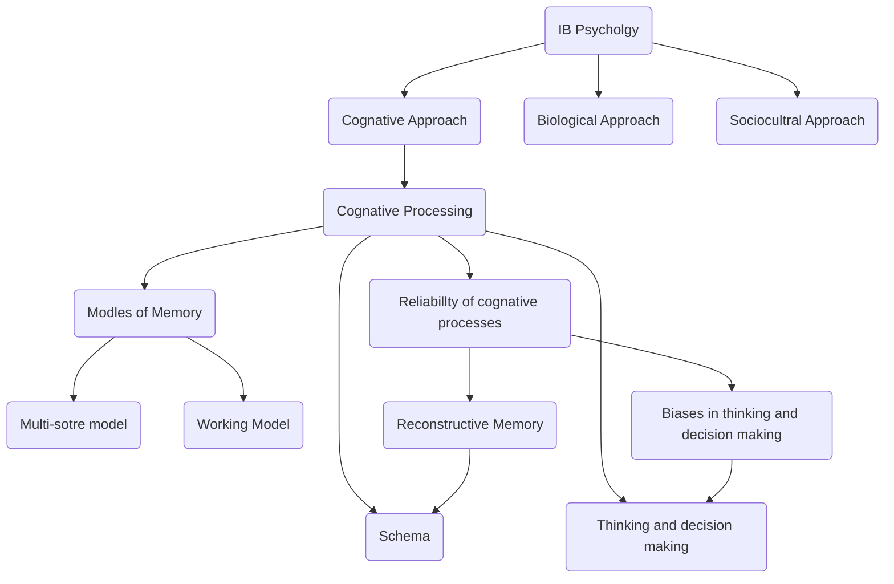

```mermaid 
graph TB;
	A(IB Psycholgy)-->B(Cognative Approach)
	A-->C(Biological Approach)
	A-->D(Sociocultral Approach)
	B-->E(Cognative Processing)
	E-->F(Modles of Memory)
	F-->H(Multi-sotre model)
	F-->I(Working Model)
	E-->J(Schema)
	E-->K(Thinking and decision making)
	E-->L(Reliabillty of cognative processes)
	L-->M(Reconstructive Memory)-->J
	L-->N(Biases in thinking and decision making)-->K
	
```
